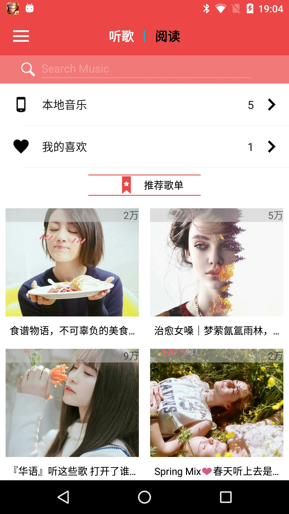
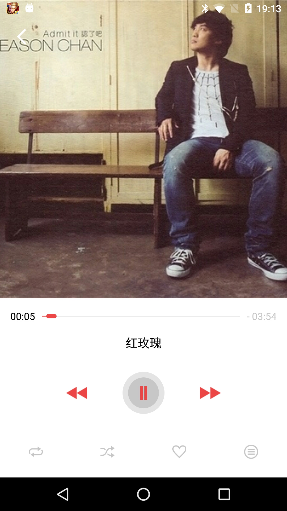
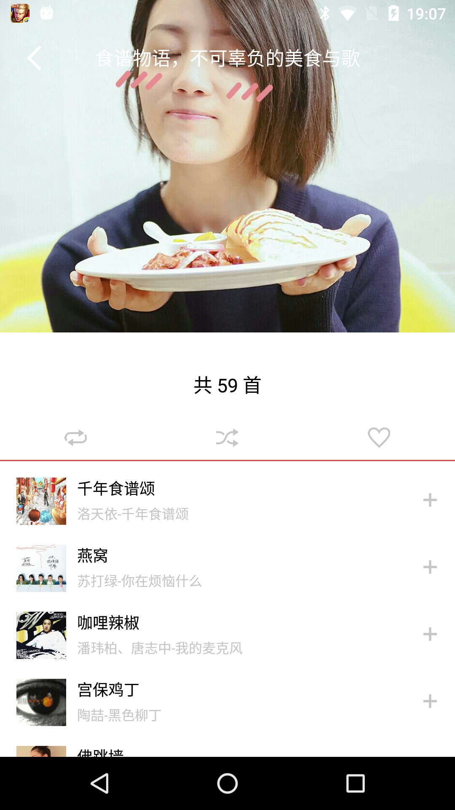
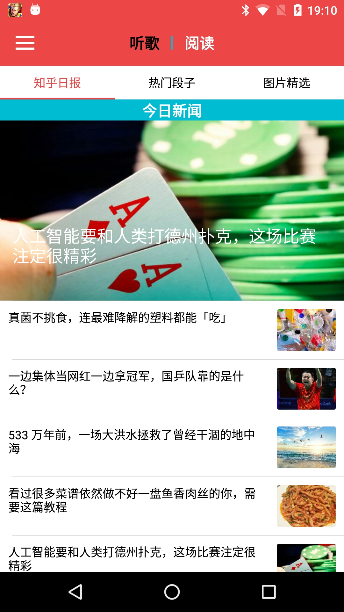
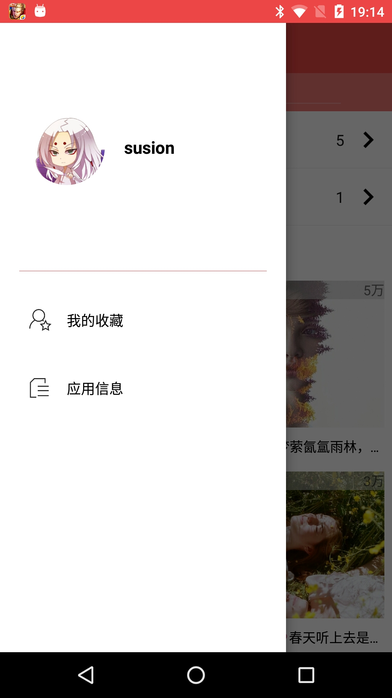
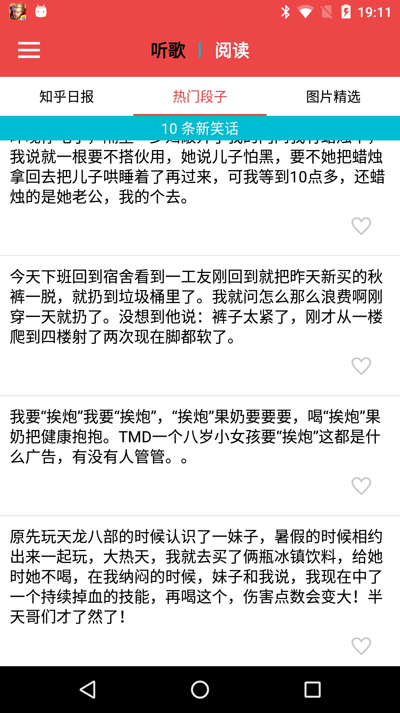
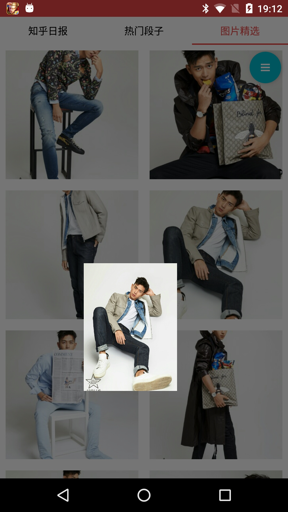
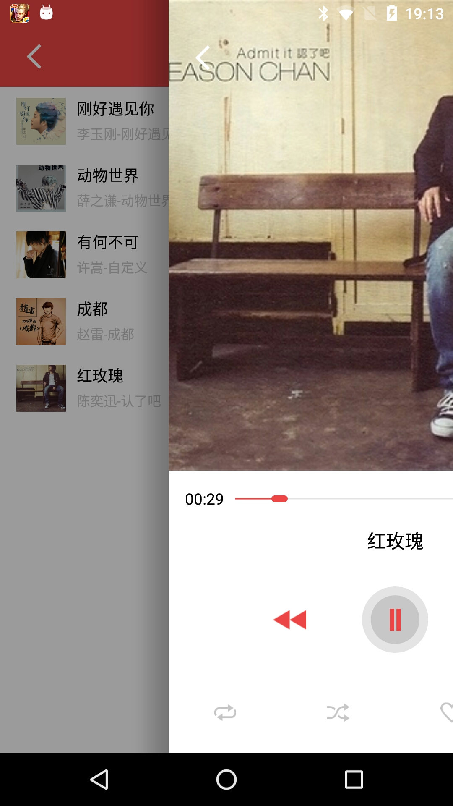

# 随 心
>刚开始写这个项目的时候是为了自己的毕业设计。
>后来慢慢的就想借这个项目来巩固自己的Android编程技能，也可以更好的站在全局来考虑项目的开发，而不只是需求的迭代开发。

## APP细节
- APP的API
    - 音乐部分，是在网络上收集的网易云音乐的API。用了挺散的， 比如 ： https://github.com/javaSwing/MusicAPI
    - 知乎日报， https://github.com/izzyleung/ZhihuDailyPurify/wiki/%E7%9F%A5%E4%B9%8E%E6%97%A5%E6%8A%A5-API-%E5%88%86%E6%9E%90
    - 段子、图片， API市场
- 对于第三方开源库的使用
    - 基础库： RxJava, Retrofit, fresco, eventbus
    - 侧滑退出
- 项目编码
    - 对于复杂的逻辑， 采用的MVP编写。
    - 由于本人是处女座，代码阅读起来应该还是比较容易的。
- github
    - https://github.com/SusionSuc/Boring
    - 当然还是希望可以给一个star的... 谢谢

- 接下来事情不是很多，对整个APP还会慢慢优化。

## APP截图

